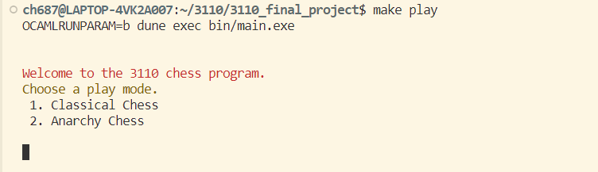
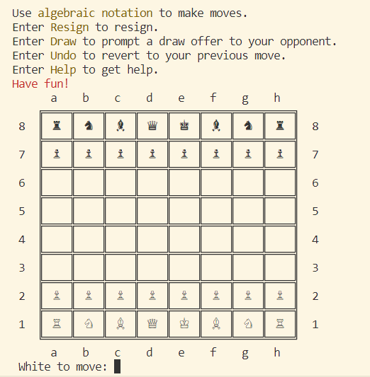
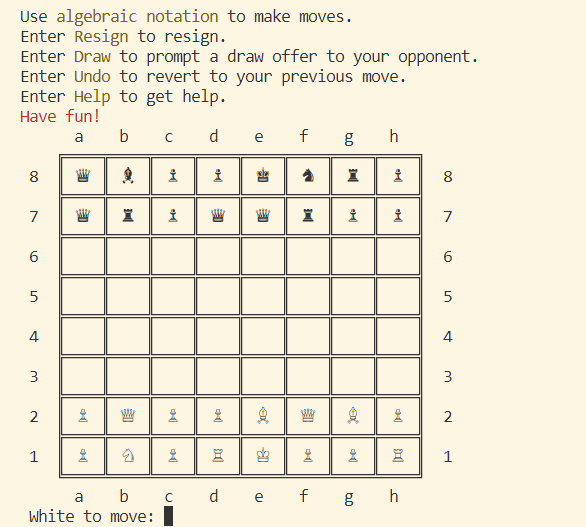

# 3110_final_project
Team members:
- Lin Jing Liu (ll676)
- Harim Hahn (hmh79)
- Doan-Viet Nguyen (dtn26)
- Chenling Huang (ch687)

  

# About
  Our project is an implementation of classical Chess Game in Ocaml. Currrently,
  it supports two player play mode via the terminal. The Chess Board is displayed
  on the terminal using special Unicode characters. The players interacts with 
  the GUI by inputting text commands in the chess notation, or by inputting other
  commands such as Undo, Resign or Draw. We have implemented normal chess piece 
  moves and other special moves in classical chess, such as castling, promotion 
  and en passant. The game can end in a draw, resignation from one player, or a 
  checkmate, which will be automatically detected by the program to infer that 
  one player has lost the game.
  In addition to classical chess, we implemented an anarchy chess mode 
  where random types of chess pieces are randomly generated on random starting 
  positions. This game mode added randomness and is a great challenge for players
  looking for one. All classical chess movement limitation and rules still applies
  in anarchy mode.

# Installation
Follow the instruction in [INSTALL.md](INSTALL.md)